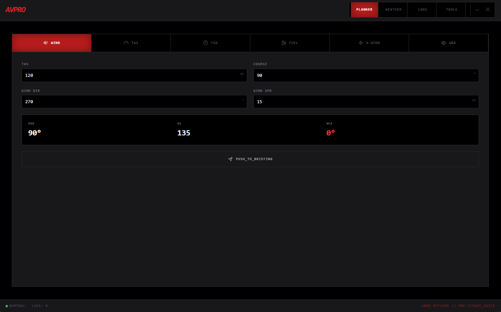
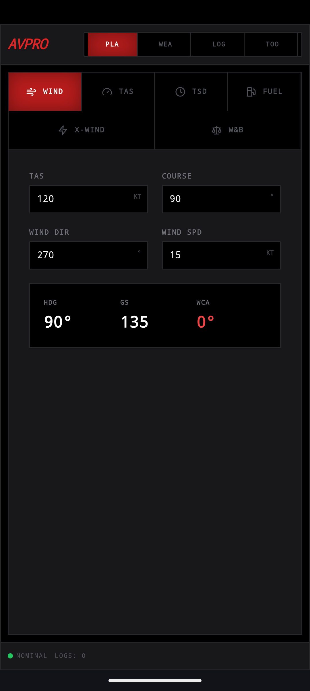

# ✈️ Aviation Pro
### The High-Performance, Design-First Pilot Suite for Desktop, Mobile, and Wear OS.

[-red?style=for-the-badge&logo=go)](https://wails.io/)
[](https://reactjs.org/)
[](https://capacitorjs.com/)
[](https://developer.android.com/wear)

**Aviation Pro** is a professional-grade pilot utility suite built for precision and visibility. Engineered with a **Unified UI Architecture**, it delivers a seamless experience across frameless desktop environments (Wails), native mobile EFBs (Capacitor), and the pilot's wrist (Wear OS).

> **Current Status:** 🚀 **Beta v1.0.0 Ready**. Now fully functional on Windows Desktop, Android Mobile (MIAD01 Optimized), and Wear OS (Pixel Watch).

---

## 🖼️ The Multi-Platform Ecosystem

| **Desktop (Wails)** | **Mobile (Capacitor)** | **Watch (Wear OS)** |
| :--- | :--- | :--- |
|  |  |  |
| *Hardware-style frameless canvas.* | *Responsive, touch-ready EFB.* | *Zulu-first Aviator Face.* |

---

## ✨ Design-First Philosophy
Led by a creative professional, the AVPRO interface mimics real glass cockpit avionics (G1000/Garmin style).
- **#FE0909 Tactical Red:** A unified branding palette optimized for high-visibility and night-vision preservation.
- **Frameless Desktop Canvas:** A pure, clutter-free experience for flight desk planning.
- **Mission-Critical Typography:** Monospaced data arrays ensure calculations remain legible and stable.
- **Adaptive Precision:** The Tailwind grid scales perfectly from phone screens to ultra-wide monitors.

---

## 🛠️ Integrated Feature Modules

### 🗺️ Flight Briefing Builder
*   **Professional PDF Export:** Generate comprehensive preflight briefings with flight plans, weather, and W&B data.
*   **Dynamic Data Sync:** Real-time integration with aviation weather APIs.

### 🌤️ Weather & E6B Calculator
*   **Atmospheric Tools:** Instant Pressure/Density Altitude conversion with ISA deviation.
*   **CX-6 Flight Computer:** Digital math for TAS, Groundspeed, Wind Correction, and Fuel Management.
*   **Cloud Base:** Essential VFR decision-making logic.

### ⚖️ Weight & Balance
*   **Dynamic CG Envelope:** Visual loading charts for standard trainer fleets (C172, Archer, etc.).
*   **Safety Interlocks:** Real-time visual alerts for out-of-envelope configurations.

### ⌚ Wear OS Companion
*   **Zulu-First Design:** High-contrast digital UTC clock for rapid mission timing.
*   **Data Bridge:** Push METAR categories (VFR/IFR) from your phone directly to your watch face complication.

---

## 🚀 Technical Architecture
- **Desktop Backend:** Golang + Wails for native performance.
- **Mobile/Web Core:** React 18 + TypeScript + Vite.
- **Mobile Bridge:** Capacitor for high-speed native Android/iOS ports.
- **Persistence:** IndexedDB (Dexie) for robust, offline-first data storage.

---

## 🔨 Deployment Workflow

### Prerequisites
- **Go** 1.20+ & **Wails CLI**
- **Node.js** & **NPM**
- **Android Studio** (for Mobile/Watch builds)

### Mobile/Watch Sync
```bash
# Build the web assets
npm run build

# Sync to Android project
npx cap copy android

# Run on MIAD01 Phone / Pixel Watch
npx cap run android
```

---

## 🗺️ Roadmap
- [x] **Desktop Release:** Stabilized frameless Wails application.
- [x] **Mobile Port:** Fully responsive Android/iOS core via Capacitor.
- [x] **Wear OS:** Zulu face with live weather complications.
- [ ] **Cross-Device Sync:** Optional cloud-relay for logbook backups.

---

## 📄 Disclaimer
Aviation Pro is for flight simulation and pre-flight planning reference only. Final responsibility for airworthiness and calculation verification rests with the Pilot in Command (PIC).

**100% OFFLINE // ONE_CODEBASE // MULTIPLE_HORIZONS**  
*Built for the cockpit, refined for the future.*
