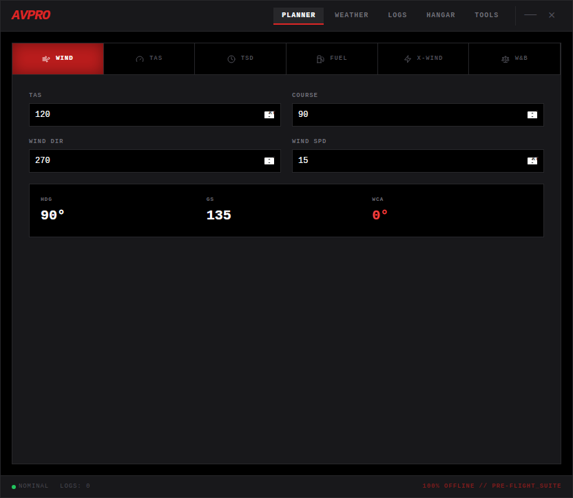

# ✈️ Aviation Pro
### The High-Performance, Design-First Flight Planning Ecosystem.

[-red?style=for-the-badge&logo=go)](https://wails.io/)
[](https://reactjs.org/)
[](https://capacitorjs.com/)

**Aviation Pro** is a professional-grade aviation suite built for the modern pilot. Currently a frameless desktop application, it is engineered with a **Universal UI Architecture**—designed to scale seamlessly from a 27-inch desktop monitor to a mobile EFB (Electronic Flight Bag) via Capacitor.

> **Status:** Current focus is UI/UX perfection and calculation accuracy on Desktop (Wails) before deploying to Web and Mobile.

---

## 🖼️ Interface Master
<div align="center">
  
  <p><i>The "Tactical Redline" UI: Engineered for zero-latency data entry and high-legibility in cockpit environments.</i></p>
</div>

---

## ✨ The Creative Professional’s Edge
As a project led by an Adobe Creative Professional, the UI isn't an afterthought—it's the core feature.
- **Frameless Desktop Canvas:** A bespoke windowing experience that removes OS clutter for a pure, hardware-like feel.
- **Mission-Critical Typography:** Monospaced data arrays ensure that calculations never "jump" or shift layouts during rapid updates.
- **Adaptive Precision:** The Tailwind-driven design system is built on a custom grid designed to eventually accommodate touch-targets for iPad/Mobile use without losing information density.
- **Dark-Vision Optimized:** A custom palette designed to preserve a pilot's night vision while providing high-contrast alerts.

---

## 🛠️ Core Feature Modules

### 🗺️ Flight Planner & E6B
*   **Dynamic Route Planning:** Real-time checkpoint management with automatic GS, ETE, and Fuel Burn calculations.
*   **Wind Triangle:** Precision Heading (HDG) and Wind Correction Angle (WCA) calculations.
*   **CX-6 Flight Computer:** Digital integration of all standard aviation math: TAS, TSD, Fuel, and X-Wind components.

### 🌤️ Weather & Performance
*   **Atmospheric Tools:** Instant Pressure/Density Altitude conversion and ISA deviation tracking.
*   **Cloud Base Calculator:** Essential VFR decision-making tools based on Temp/Dew Point spread.
*   **Performance Warnings:** Visual cues for high-density altitude and "High/Hot" takeoff risks.

### ⚖️ Weight & Balance
*   **Dynamic CG Envelope:** Visual loading charts that update in real-time as you add passengers, cargo, and fuel.
*   **Safety Interlocks:** Out-of-bounds alerts preventing unsafe take-off configurations.

### 📓 Digital Logbook & Hangar
*   **Persistent Storage:** Local-first data persistence for flight logs and aircraft profiles.

---

## 🚀 Technical Architecture
The stack is chosen for its ability to bridge the gap between high-performance desktop software and cross-platform mobility:

- **Backend (Desktop):** [Golang](https://golang.org/) + [Wails](https://wails.io/) for native system performance and lightweight binaries.
- **Frontend (The Core):** [React 18](https://reactjs.org/) + [TypeScript](https://www.typescriptlang.org/) for a type-safe, componentized design system.
- **Styling:** [Tailwind CSS](https://tailwindcss.com/) for rapid UI iteration and responsive scaling.
- **Future-Proofing:** Prepared for [Capacitor](https://capacitorjs.com/) to wrap the web core into a native iOS/Android EFB application.

---

## 🔨 Development Workflow

### Prerequisites
- **Go** 1.20+ & **Wails CLI**
- **Node.js** (NPM)

### Local Setup
```bash
# Clone the repository
git clone https://github.com/robfernan/AviationPro.git

# Install Frontend dependencies
cd AviationPro/frontend && npm install

# Run in Wails Dev Mode (Frameless Desktop)
cd ..
wails dev
```

---

## 🗺️ Roadmap to 1.0
1.  [x] **UI Perfection:** Finalize the "Tactical Redline" design system (Current Phase).
2.  [x] **Desktop Release:** Stabilize Wails/Go frameless application for Windows/Mac/Linux.
3.  [ ] **Web Deployment:** Release the suite as a PWA (Progressive Web App).
4.  [ ] **Mobile Port:** Utilize Capacitor to deliver a native mobile experience for pilots using iPads in the cockpit.

---

## 📄 Disclaimer
Aviation Pro is for flight simulation and pre-flight planning reference only. Always verify calculations with an official Pilot’s Operating Handbook (POH) and consult current NOTAMs and weather briefings from authorized services.

**100% OFFLINE // ONE_CODEBASE // MULTIPLE_HORIZONS**  
*Built for the cockpit, refined for the future.*